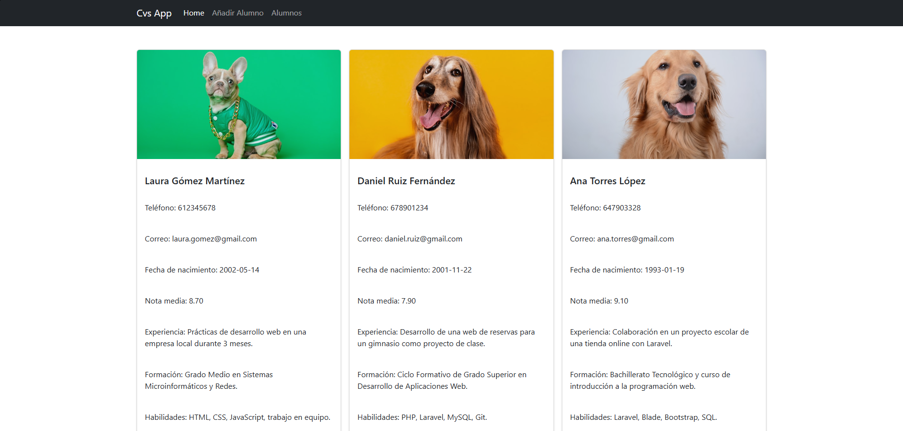
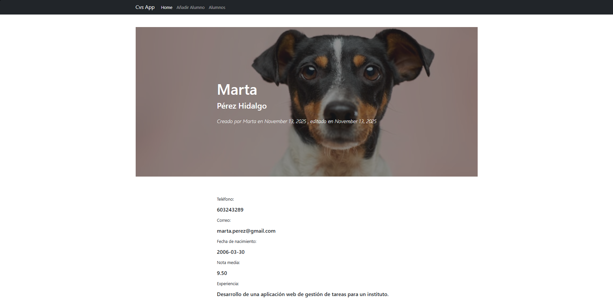

# 💼 CvsApp – Gestor de currículums de alumnos

**CvsApp** es una aplicación web desarrollada con **Laravel** que permite gestionar los currículums de los alumnos de forma sencilla.  
El proyecto forma parte del módulo *Desarrollo Web en Entorno Servidor* y tiene como objetivo practicar la creación de una aplicación completa con operaciones **CRUD** (crear, ver, editar y eliminar).

Además de las funciones básicas, la aplicación incluye la posibilidad de **subir fotografías** y mostrar **mensajes de confirmación o error** de manera visual.  
Su diseño está pensado para ser claro y fácil de usar, con vistas creadas mediante **Blade** y estilos personalizados.

---

## ⚙️ Funcionalidades principales

- Crear nuevos currículums de alumnos.  
- Ver la información completa de cada alumno.  
- Editar y actualizar los datos registrados.  
- Eliminar currículums con confirmación mediante ventana modal.  
- Subida de imágenes para incluir fotografía en el CV.  
- Mensajes automáticos de éxito o error al realizar acciones.

---

## 🖼️ Capturas de pantalla

A continuación se muestran algunas imágenes del funcionamiento de la aplicación:

  

---

👨‍💻 **Proyecto realizado por Luis Vargas Verdejo**
